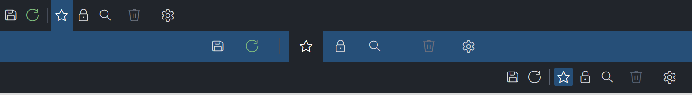

# PsIconPanel

An owner-drawn horizontal icon strip for FreeBASIC Win32 applications: a run of glyph cells —
latching toggles, momentary command buttons, and drawn separator rules — laid out left to right
in the order you supply them.

It is the control you reach for when you want a small toolbar whose spacing you decide, rather
than one that decides for you. **Every cell width is declared, never measured.** You give each
item an icon size and the space before and after it; the control lays those cells out in order
and never adjusts, redistributes or squeezes them. The one thing it recomputes when the host
resizes the panel is where the whole run sits inside the client area — left, centred or right,
moved as a single block.

**The item set is static by contract.** Items are added once, when you build the panel, and
there is no `InsertItem`, no `DeleteItem` and no `Clear` — nothing removes or reorders an item
once it exists. Everything you do at runtime goes through the state setters
(`PsIconPanel_SetSelected`, `PsIconPanel_SetEnabled`, `PsIconPanel_SetGlyph`,
`PsIconPanel_SetItemForeColor`), each of which addresses an item that is still exactly where you
put it. If you need a strip whose contents change at runtime, this is not the control for it.

It draws itself entirely — there is no system control underneath, and nothing about its
appearance depends on the visual style the user happens to be running. Every colour it paints is
one you can set, and the whole painter can be replaced with a single callback.

---

## What it looks like



The same seven items laid out in three panels: left-justified, centre-justified on a blue theme, and right-justified. A latching toggle is shown selected in the first and third, and the thin rules are control-drawn separators that are deliberately **not hit-testable**. Every cell width is declared by the author, never measured — which is what separates this from `PsStatusBar`'s auto-sizing panels. Cropped below the panels.

---

## Requirements

**Files to copy into your project:**

| File | Purpose |
|---|---|
| `PsIconPanel.bi` | Declarations — types, callbacks, constants, function prototypes |
| `PsIconPanel.inc` | Implementation |
| `PsBufferPaint.bi` | The flicker-free drawing surface the control paints through |
| `PsBufferPaint.inc` | Its implementation |
| `PsImage.bi` / `PsImage.inc` | The image loader behind `PsIconPanel_SetImage`. Required even if you only ever use glyphs: `PsIconPanel.bi` includes it. |
| `PsTipHost.bi` / `PsTipHost.inc` | The tooltip backend switch — see *Tooltips: two backends* |
| `PsTooltip.bi` / `PsTooltip.inc` | The owner-drawn tooltip. Required even if you never switch to it: `PsTipHost.inc` includes it. |

**AfxNova is required.** The control is built on `CWindow`, and `PsBufferPaint` draws through
`AfxNova\CGdiPlus.inc`. Sources include AfxNova relative to the workspace root
(`#include once "AfxNova\CWindow.inc"`), so builds need the workspace root on the include path:

```bash
fbc64.exe -i "C:\dev" main.bas
```

**Include order.** `PsIconPanel.inc` pulls in its own `.bi` (which pulls in `PsBufferPaint.bi`,
`PsImage.bi` and `PsTipHost.bi`) and then `PsTipHost.inc` and `PsImage.inc` themselves — so
adopting the image and tooltip features adds no include line of your own. The two implementation
files you write are included in this order, after AfxNova and after `using AfxNova`:

```freebasic
#include once "windows.bi"
#include once "AfxNova\CWindow.inc"
#include once "AfxNova\AfxStr.inc"
#include once "AfxNova\AfxGdiplus.inc"

using AfxNova

#include once "PsBufferPaint.inc"
#include once "PsIconPanel.inc"
```

**GDI+ must be running before the first repaint and must outlive the last one.** `PsBufferPaint`
renders geometry through GDI+, so bracket your message loop:

```freebasic
dim as ULONG_PTR gdipToken = AfxGdipInit()
' ... create windows, run the message loop ...
AfxGdipShutdown( gdipToken )
```

`AfxGdipShutdown` must come after every window is destroyed, because each repaint builds and
tears down a `PsBufferPaint`. If your host also initialises COM, shut GDI+ down before
`CoUninitialize` — GDI+ leans on COM.

**Never name an identifier `ok`.** GDI+ defines `Ok = 0` as a `Status` enum value in namespace
`AfxNova`, and hosts customarily say `using AfxNova`. An existing variable, parameter or
function called `ok` becomes a duplicate definition the moment you adopt these files. Use `bOK`
instead.

**There is no pump obligation.** The control installs no message filter and asks nothing of your
message loop. It does not take focus, is not a tabstop, and handles no keyboard input, so it
needs neither `IsDialogMessage` nor a `FilterMessage` call of its own to work correctly.

**You supply and own the glyph font.** The control never creates an `HFONT`. Hand it one with
`PsIconPanel_SetFont`, keep it alive for as long as the control is painting, and destroy it
yourself. The glyphs are normally Segoe Fluent Icons codepoints, so the font you pass is normally
that face at a size that fits your icon cell.

---

## Quick start

```freebasic
' Create it. The control is created zero-sized and hidden.
dim as HWND hPanel = PsIconPanel_Create( hWndParent, IDC_MYFORM_ICONPANEL )

' The font is a paint-time input. The caller owns this HFONT.
PsIconPanel_SetFont( hPanel, ghFont(SYMBOLFONT_12) )
PsIconPanel_SetJustify( hPanel, IP_JUSTIFY_LEFT )

' Be told what the user did.
PsIconPanel_SetClickCallback( hPanel, @MyPanel_Click )           ' COMMAND items
PsIconPanel_SetSelChangeCallback( hPanel, @MyPanel_SelChange )   ' TOGGLE items

' Build the strip. This happens once: items are never removed or reordered.
dim as long idx

idx = PsIconPanel_AddItem( hPanel, IP_KIND_COMMAND, wchr(&hE74E), IDM_SAVE )
PsIconPanel_SetTooltipText( hPanel, idx, "Save" )

idx = PsIconPanel_AddItem( hPanel, IP_KIND_COMMAND, wchr(&hE72C), IDM_REFRESH )
PsIconPanel_SetTooltipText( hPanel, idx, "Refresh" )
PsIconPanel_SetItemForeColor( hPanel, idx, BGR(126,190,126) )    ' idle glyph colour only

PsIconPanel_AddSeparator( hPanel )

idx = PsIconPanel_AddItem( hPanel, IP_KIND_TOGGLE, wchr(&hE734), IDM_FAVOURITE )
PsIconPanel_SetTooltipText( hPanel, idx, "Favourite" )
PsIconPanel_SetSelected( hPanel, idx, true )   ' silent: no SelChange callback

' Place it like any window. GetIdealWidth is the summed width of every cell, and is
' valid before the control has ever been sized.
SetWindowPos( hPanel, 0, x, y, PsIconPanel_GetIdealWidth( hPanel ), nHeight, SWP_NOZORDER )
ShowWindow( hPanel, SW_SHOW )
```

And the two callbacks:

```freebasic
sub MyPanel_Click( byval hPanel as HWND, byval idx as long, byval id as long )
    ' A COMMAND item: a matched press and release on the same item.
    SendMessage( ghMainWindow, WM_COMMAND, id, 0 )
end sub

sub MyPanel_SelChange( byval hPanel as HWND, byval idx as long, byval isSelected as boolean )
    ' A TOGGLE item the USER flipped. The state is already updated, so
    ' PsIconPanel_GetSelected( hPanel, idx ) = isSelected.
    gConfig.ShowFavourites = isSelected
end sub
```

That is the whole minimum. Everything below is refinement.

---

## Concepts

### The handle is a real HWND

`PsIconPanel_Create` returns an ordinary window handle, and every `PsIconPanel_*` function takes
it. It is not an opaque type, so you can treat the control as the window it is — `SetWindowPos`
to place and size it, `ShowWindow` to show it, `GetDlgItem` to find it by the `CtrlID` you passed
at creation. Any number of instances can coexist; each owns all of its own state, including its
hover and press tracking.

### It is created zero-sized and hidden

`PsIconPanel_Create` gives the control the styles `WS_CHILD`, `WS_CLIPSIBLINGS` and
`WS_CLIPCHILDREN`. `WS_VISIBLE` is deliberately absent, so a newly created control shows nothing
until you size it and call `ShowWindow`. That lets you build and configure the whole strip before
it is ever seen. There is no `WS_TABSTOP` and there are no child windows: the control window *is*
the panel, and every item is drawn in its own `WM_PAINT`. Clicking it does not call `SetFocus`,
so a toolbar cannot steal the caret from the editor beside it.

### The cell model: you own the spacing

Each item occupies a **cell**, and the cell's width is the sum of three declared numbers. There
is no measuring step anywhere in this control.

```
  cellWidth(i)  = padBefore(i) + iconWidth(i)   + padAfter(i)     TOGGLE / COMMAND
                = padBefore(i) + separatorWidth + padAfter(i)     SEPARATOR

  padBefore(i)  = the item's own value, or the panel's when the item's is -1
  padAfter(i)   = the item's own value, or the panel's when the item's is -1
  iconWidth(i)  = the item's own value, or the panel's when the item's is  0
  iconHeight(i) = the item's own value, or the panel's when the item's is  0
                  (clamped down to the client height, once there is one)

  totalW        = sum of every cellWidth        <- this is GetIdealWidth

  x0            = clientLeft                          LEFT, or totalW >= clientW
                = clientLeft + (clientW-totalW) \ 2   CENTER
                = clientRight - totalW                RIGHT

  rc(i)         = ( x, clientTop, x + cellWidth(i), clientBottom )   FULL client height
  rcIcon(i)     = ( x + padBefore(i), yTop,
                    x + padBefore(i) + iconWidth(i), yTop + iconHeight(i) )
                  where yTop = clientTop + (clientH - iconHeight(i)) \ 2
  x            += cellWidth(i)
```

Two things follow from that, and they are the point of the control:

- **A resize moves `x0` and nothing else.** The spacing inside the run is authored and is never
  adjusted, redistributed or squeezed. Drag the host narrower and the run slides as one block.
- **Nothing is measured**, so the layout pass never takes a device context and never asks the
  font about anything.

`rc` spans the **full client height**, so the hot and selected fills read like a menu bar and the
hit target includes the item's padding. Only `rcIcon` is vertically centred. `rcIcon` is placed
horizontally at `padBefore` from the cell's left edge — so the glyph sits centred within its cell
only when `padBefore` and `padAfter` are equal, which is what the defaults give you.

Layout is lazy. A setter marks the layout stale and asks for a repaint; the next paint — or any
rect or ideal-width query — recomputes it. There is no begin-update / end-update pair to
remember, and building a panel of twenty items costs one layout pass, not twenty.

### Three kinds of item

| Kind | Behaviour |
|---|---|
| `IP_KIND_TOGGLE` | Latches. A matched click flips `isSelected` and fires the SelChange callback. |
| `IP_KIND_COMMAND` | Momentary. Draws pressed while held, fires the Click callback on a matched release, and never latches. |
| `IP_KIND_SEPARATOR` | A vertical rule the control draws itself. **Not hit-testable**: it never goes hot, never presses, and `PsIconPanel_HitTest` returns -1 for it. |

The kind is fixed when the item is added and never changes. A separator's rule takes the place of
the icon *width* in its cell but keeps the icon *height*, so the rule stands exactly as tall as
the icons it divides. Give a separator its own padding to control the size of the visual gap it
makes.

### Selection is a set, not a current item

There is no "current item" here. Every `IP_KIND_TOGGLE` item latches independently, so the
selected flag lives on the item and any number of them can be latched at once. Hover, by
contrast, is transient and single-valued, so the hot state lives on the control — exactly one
item is hot, or none.

**Radio behaviour is yours to implement**, and the natural place is inside your own SelChange
handler. `PsIconPanel_SetSelected` is silent, so clearing the other items from there cannot
recurse:

```freebasic
sub MyPanel_SelChange( byval hPanel as HWND, byval idx as long, byval isSelected as boolean )
    if isSelected = false then
        ' Refuse to let the user turn the current one off, if that is the semantic you want.
        PsIconPanel_SetSelected( hPanel, idx, true )
        exit sub
    end if
    ' Exactly-one behaviour: clear every other toggle. These calls are silent, and
    ' SetSelected simply returns FALSE for the commands and separators it meets.
    for i as long = 0 to PsIconPanel_GetCount( hPanel ) - 1
        if i <> idx then PsIconPanel_SetSelected( hPanel, i, false )
    next
end sub
```

### Programmatic changes are silent

`PsIconPanel_SetSelected` never fires the SelChange callback, and nothing fires the Click callback
except a user's matched press and release. The callbacks report **user** action and nothing else,
which follows Win32's own `TCM_SETCURSEL` / `TCN_SELCHANGE` split — and it is what makes the
snippet above safe.

### The font is a paint-time input

`PsIconPanel_SetFont` repaints the control but does **not** re-lay it out, because nothing about
the geometry came from the font in the first place. Changing the font changes only the glyphs you
see inside cells whose size you already declared.

The consequence to plan for: `rcIcon` is a **layout** cell, not a measurement of your glyph.
Nothing measures the text, so a font too large for the cell simply clips. Pick a point size that
fits the icon size you asked for.

### An icon cell holds a glyph or an image, never both

`PsIconPanel_SetImage` takes a file path — `.ico`, `.png`, `.bmp`, `.jpg` — and draws that image
in the item's icon cell **instead of** a glyph. The setters keep the invariant themselves: a
successful `SetImage` clears that item's glyph string, and `PsIconPanel_SetGlyph` with a non-empty
glyph frees that item's image. You never have to clear one before setting the other.

The image is drawn into the **same declared cell** a glyph would have used, aspect ratio
preserved, vertically and horizontally centred in `rcIcon`. Because every cell width is declared
rather than measured, switching an item from a glyph to an image changes **no geometry at all** —
the ideal width and the cell rect are identical either way, and no layout pass is needed.

The control **owns** the images it loads. They are freed when the window is destroyed, when you
pass `""`, when the load fails, and when you set a glyph on that item. You pass a path and nothing
else; there is no handle for you to keep alive or release.

```freebasic
if PsIconPanel_SetImage( hPanel, idx, ExePath() & "\save.png" ) = false then
    PsIconPanel_SetGlyph( hPanel, idx, wchr(&hE74E) )    ' fall back to the glyph
end if
```

### Pixels, and who scales them

Only the creation-time defaults are DPI-scaled for you:

| Setting | Default | DPI-scaled at create? |
|---|---:|---|
| Icon cell width | 20 | Yes |
| Icon cell height | 20 | Yes |
| Padding before | 4 | Yes |
| Padding after | 4 | Yes |
| Separator rule width | 1 | Yes |

Every setter afterwards takes raw pixels and expects **you** to scale — typically
`pWindow->ScaleX(...)` / `ScaleY(...)`.

### How a click is decided

Pressing the left button over an enabled, non-separator item takes mouse capture and arms the
press. The action happens on **release**, and only if the cursor is still over the same item. So
the standard escape gesture works: press an icon, slide off, release — nothing fires.

While a press is live and the cursor has slid outside, the item stops painting as pressed but the
gesture is not over. Slide back on and it re-arms. Only a release, a capture loss, or disabling
the pressed item ends it.

The control pays the full price of holding capture: it releases on the up-message before any
callback runs, it cancels the press on `WM_CAPTURECHANGED`, it releases on `WM_DESTROY`, and your
message callback's return value is ignored for `WM_LBUTTONUP` so that it cannot strand the
capture.

### Hover tracking has a safety net

The control asks for `WM_MOUSELEAVE`, but that message is not reliably delivered when the cursor
exits quickly or onto another window. A 100 ms timer runs while the cursor is over the control
and clears the hot item if the cursor has gone. You do not have to do anything about this; it is
mentioned because the control does own a timer while you are hovering it, and stops it when you
are not.

### Tooltips

One tooltip tool covers the whole control — the items are painted rectangles, not windows — and
it pulls its text on demand for whichever item is currently hot. Text resolves in this order:

1. The item's own text, from `PsIconPanel_SetTooltipText`.
2. The tooltip callback, if one is installed. Consulted **only** for items with no text of their
   own.
3. Nothing. An item with neither shows no tip; there is no caption to fall back on, because an
   icon has none.

Moving to a different item pops the current tip, so the next hover re-queries.

Tips are drawn by one of two backends — the comctl32 tooltip by default, or PsTooltip if you ask
for it with `PsIconPanel_SetTooltipMode`. The choice changes only how a tip is drawn and driven,
never what it says: the resolution order above is the same on both. See *Tooltips: two backends*.

### Lifetime

The control frees itself when its window is destroyed, and destroys its own tooltip window with
it, whichever tooltip backend it is on. It also frees every image loaded through
`PsIconPanel_SetImage`. It owns no host resources: the `HFONT` you passed in stays yours. Destroy
the parent and you are done.

---

## Behaviour and limits

Firm properties of the control, not settings:

- **The item set is static.** There is no `InsertItem`, no `DeleteItem`, no `Clear` and no way to
  reorder. `PsIconPanel_AddItem` and `PsIconPanel_AddSeparator` are the only way an item comes into
  existence, and nothing takes one out again. Build the strip once, then drive it with
  `SetSelected` / `SetEnabled` / `SetGlyph` / `SetItemForeColor`. A strip whose contents change at
  runtime needs a different control.
- **Nothing is measured.** Cell widths are declared, the layout never takes a device context, and
  `PsIconPanel_SetFont` therefore repaints without re-laying out. A glyph too big for its cell
  clips.
- **Separators are decoration, not targets.** They are excluded from hit-testing and from
  `PsIconPanel_FindItemByID` — they all carry id 0, so a search for 0 would otherwise find
  decoration — and they have no click behaviour of their own.
- **When the run is wider than the client area, justification degrades to LEFT and the tail clips
  at the right edge.** Rects are computed honestly rather than squeezed, so the leading icons stay
  correct and reachable and only the overflow is lost. Hit-testing stays correct for free: the
  hover path rejects any point outside the client area, so a cell running past the right edge
  cannot be lit up by a cursor over the window next door.
- **Invalid justification values are ignored**, leaving the current setting in place.
- **Double-clicks are not special.** `CS_DBLCLKS` is deliberately off, so a rapid second click
  arrives as an ordinary down/up pair and toggles the item again. With `CS_DBLCLKS` on, every
  second rapid click would arrive as `WM_LBUTTONDBLCLK` and be dropped — and a toolbar has no
  double-click semantic to gain in exchange.
- **The control never takes focus and handles no keyboard input.** It is not a tabstop, it does
  not call `SetFocus` on a click, and there are no keyboard equivalents for its items.
  Accelerators are the host's business.
- **The right mouse button is reported, never acted on.** A context menu is your business. No
  capture is taken for the right button, so a right-up can arrive without a matching down.
- **A disabled item still occupies its cell.** It greys out, never goes hot, never presses and
  swallows clicks — but `PsIconPanel_HitTest` still reports it, because a caller asking "what is
  here" deserves the truth. Disabling the item under a live press cancels the press immediately.
- **`PsIconPanel_SetSelected` refuses anything that is not an `IP_KIND_TOGGLE` item** and returns
  FALSE.
- **The item kind is not validated on add.** Pass something other than the three `IP_KIND_*`
  values and the item is stored, laid out, hit-tested and painted as a non-separator, but a
  completed click on it does nothing.
- **Item rects are empty until the control has been sized.** The layout bails out when the client
  area is zero in either dimension, so `PsIconPanel_GetItemRect` and `PsIconPanel_GetItemIconRect`
  return empty rectangles between `PsIconPanel_Create` and the first `SetWindowPos`.
  `PsIconPanel_GetIdealWidth` is the exception and is valid immediately — it does not depend on the
  client area, and it is exactly what you call to decide what that size should be.
- **A paint callback replaces the built-in painter for every item**, separators included. There is
  no way to override one kind and inherit the rest.

---

## API reference

### Creation

| Function | Description |
|---|---|
| `PsIconPanel_Create( hWndParent, CtrlID ) as HWND` | Creates the control as a child of `hWndParent` and returns its window handle. `CtrlID` becomes the window's `GWLP_ID`, so `GetDlgItem` finds it. Created zero-sized and hidden — build it, size it with `PsIconPanel_GetIdealWidth`, place it with `SetWindowPos`, then `ShowWindow`. There are no child controls. |

### Items

Adding is the only way an item comes into existence, and there is no way to remove one.

| Function | Description |
|---|---|
| `PsIconPanel_AddItem( hIconPanel, itemKind, Glyph, id = 0, itemData = 0 ) as long` | Appends an item and returns its index, or -1 if the handle is not a PsIconPanel. `itemKind` is `IP_KIND_TOGGLE` or `IP_KIND_COMMAND`; `Glyph` is the codepoint(s) to draw, `id` the host command id reported by the Click callback, `itemData` a free-form payload. The kind is not validated. |
| `PsIconPanel_AddSeparator( hIconPanel ) as long` | Appends an `IP_KIND_SEPARATOR` item — no glyph, no id, no click behaviour — and returns its index, or -1. Give it its own padding to size the gap it makes. |
| `PsIconPanel_GetCount( hIconPanel ) as long` | Number of items, separators included. 0 for an invalid handle. |
| `PsIconPanel_IsValidItem( hIconPanel, idx ) as boolean` | TRUE when `idx` is in range. |
| `PsIconPanel_FindItemByID( hIconPanel, id ) as long` | Index of the **first** item carrying that id, or -1. Separators are skipped. |
| `PsIconPanel_HitTest( hIconPanel, x, y ) as long` | The item at that **client-coordinate** point, or -1. Forces any pending layout first, so the answer is always current. Separators are excluded; disabled items are included. |
| `PsIconPanel_GetItemKind( hIconPanel, idx ) as long` | The item's `IP_KIND_*`, or -1 for an invalid index. |
| `PsIconPanel_Refresh( hIconPanel )` | Marks the layout stale and requests a repaint with background erase. Rarely needed — every mutator does this for you. |

### Item state

Every `Set*` here returns FALSE for an invalid item index.

| Function | Description |
|---|---|
| `PsIconPanel_GetGlyph( hIconPanel, idx ) as DWSTRING` | The item's glyph, or `""` for an invalid index. |
| `PsIconPanel_SetGlyph( hIconPanel, idx, Glyph ) as boolean` | Sets it and repaints **that item only**. Never re-lays-out: the cell width is declared, so a glyph swap cannot move anything. A non-empty glyph frees any image on that item — the cell holds one or the other. |
| `PsIconPanel_SetImage( hIconPanel, idx, Path ) as boolean` | Loads an image file (`.ico` / `.png` / `.bmp` / `.jpg`) into the item's icon cell **instead of** its glyph, drawn into the same declared cell with its aspect preserved. Returns TRUE when the item ends up as you asked — a successful load, or a successful removal via `""` — and FALSE only for a bad index or a file that would not decode. On a successful load it clears the item's glyph string; on a failed one it drops the half-built image so nothing draws. Repaints that item only; never re-lays-out, because the cell width is declared. The control owns the image and frees it. |
| `PsIconPanel_GetItemID( hIconPanel, idx ) as long` | The host command id, or 0 for an invalid index. |
| `PsIconPanel_SetItemID( hIconPanel, idx, id ) as boolean` | Sets it. No repaint — the id is not drawn. |
| `PsIconPanel_GetItemData( hIconPanel, idx ) as integer` | The free-form host payload, or 0 for an invalid index. |
| `PsIconPanel_SetItemData( hIconPanel, idx, itemData ) as boolean` | Sets it. No repaint. |
| `PsIconPanel_GetSelected( hIconPanel, idx ) as boolean` | TRUE when this TOGGLE item is latched. |
| `PsIconPanel_SetSelected( hIconPanel, idx, isSelected ) as boolean` | Latches or unlatches a TOGGLE item and repaints it. **Silent** — does not fire the SelChange callback, which is what makes it safe to call from inside that handler. Returns FALSE for an invalid index **or for an item that is not `IP_KIND_TOGGLE`**. A no-op returns TRUE without repainting. |
| `PsIconPanel_GetEnabled( hIconPanel, idx ) as boolean` | The item's enabled state. |
| `PsIconPanel_SetEnabled( hIconPanel, idx, isEnabled ) as boolean` | Greys the item, stops it going hot, and makes it swallow clicks. Disabling the item the cursor is on clears the hot state immediately; disabling the item under a live press cancels the press. A no-op returns TRUE without repainting. Works on any kind, separators included. |
| `PsIconPanel_GetTooltipText( hIconPanel, idx ) as DWSTRING` | The item's own tooltip text, or `""`. |
| `PsIconPanel_SetTooltipText( hIconPanel, idx, Text ) as boolean` | Sets the item's own tooltip text. `""` means "ask the tooltip callback instead". |

### Geometry and layout

The panel-level setters take **raw pixels**; you do the DPI scaling. Each marks the layout stale
and requests a repaint. The per-item setters override the panel value for one item.

| Function | Description |
|---|---|
| `PsIconPanel_GetJustify( hIconPanel ) as long` | Where the run sits: `IP_JUSTIFY_LEFT` (the default), `IP_JUSTIFY_CENTER` or `IP_JUSTIFY_RIGHT`. |
| `PsIconPanel_SetJustify( hIconPanel, nJustify )` | Moves the whole run as one block; re-applied on every resize. Values outside the three constants are ignored. Degrades to LEFT when the run is as wide as the client area or wider. |
| `PsIconPanel_GetIconSize( hIconPanel, byref nIconWidth, byref nIconHeight )` | The panel-wide icon cell size. Both outputs are 0 for an invalid handle. |
| `PsIconPanel_SetIconSize( hIconPanel, nIconWidth, nIconHeight )` | Sets it; each dimension clamped to a minimum of 0. A **layout** input: this is the width every item contributes unless it overrides it. |
| `PsIconPanel_GetPadding( hIconPanel, byref nPadBefore, byref nPadAfter )` | The panel-wide space reserved before and after each icon. Both outputs are 0 for an invalid handle. |
| `PsIconPanel_SetPadding( hIconPanel, nPadBefore, nPadAfter )` | Sets it; each clamped to a minimum of 0. This is the spacing control the layout never touches. |
| `PsIconPanel_GetSeparatorWidth( hIconPanel ) as long` | The thickness of a separator's rule. |
| `PsIconPanel_SetSeparatorWidth( hIconPanel, nSepWidth )` | Sets it; clamped to a minimum of 0. It takes the place of the icon width in a separator's cell. |
| `PsIconPanel_SetItemPadding( hIconPanel, idx, nPadBefore, nPadAfter ) as boolean` | Overrides one item's padding. **Pass -1 for either side to go back to inheriting** the panel's value; anything below -1 is clamped to -1. |
| `PsIconPanel_SetItemIconSize( hIconPanel, idx, nIconWidth, nIconHeight ) as boolean` | Overrides one item's icon size. **Pass 0 for either dimension to go back to inheriting** the panel's value; negatives are clamped to 0. On a separator the width is ignored — its rule is the separator width — but the height still sets how tall the rule stands. |
| `PsIconPanel_GetItemRect( hIconPanel, idx, byref rc ) as boolean` | The item's full cell in client coordinates: the fill rect and the hit rect, spanning the full client height. Forces a pending layout. FALSE for a bad index. |
| `PsIconPanel_GetItemIconRect( hIconPanel, idx, byref rc ) as boolean` | The item's glyph box: the icon size, vertically centred, placed `padBefore` from the cell's left edge. Forces a pending layout. FALSE for a bad index. |
| `PsIconPanel_GetIdealWidth( hIconPanel ) as long` | The summed width of every cell — what the panel would have to be for the run to exactly fill it. Forces a pending layout, and is **valid before the control has ever been sized**, which is what makes it usable for deciding that size. |

Both rect queries return empty rectangles until the control has a non-zero client area, because
placement is impossible before then.

### Appearance

| Function | Description |
|---|---|
| `PsIconPanel_GetColors( hIconPanel, pColors as PSICONPANEL_COLORS ptr )` | Fills your struct with the control's current colours. |
| `PsIconPanel_SetColors( hIconPanel, pColors as PSICONPANEL_COLORS ptr )` | Copies the whole struct in and repaints with background erase. |
| `PsIconPanel_SetItemForeColor( hIconPanel, idx, clr ) as boolean` | Overrides one item's **idle** glyph colour — a red record dot, a green run arrow. Hot, pressed, selected and disabled keep the panel's colours, so a hover always speaks the panel's language. Repaints that item. |
| `PsIconPanel_ClearItemForeColor( hIconPanel, idx ) as boolean` | Drops the override; the item goes back to the panel's `ForeColor`. Repaints that item. |
| `PsIconPanel_GetFont( hIconPanel ) as HFONT` | The glyph font handle, or 0. |
| `PsIconPanel_SetFont( hIconPanel, hIconFont ) as boolean` | Stores the handle and repaints the whole control. **The caller owns the font** and must keep it alive and destroy it. Does **not** re-lay-out: the font is a paint-time input only. FALSE for an invalid handle. |
| `PsIconPanel_GetTooltipHandle( hIconPanel ) as HWND` | The **comctl32** tooltip window, for any `TTM_*` message you want to send it yourself. The control owns it and destroys it. Returns **0** while this panel is on the PsTooltip backend — the honest answer, since a `TTM_*` sent to a PsTooltip window is silently ignored. |
| `PsIconPanel_GetPsTooltipHandle( hIconPanel ) as HWND` | The **PsTooltip** window, or 0 while on the system backend. The door to `PsTooltip_SetColors` / `SetFonts` / `SetStyle` / `SetMaxWidth` / `SetTitle` / `SetGlyph` — none of which is mirrored here. |
| `PsIconPanel_SetTooltipMode( hIconPanel, nMode ) as boolean` | `PSTIP_MODE_SYSTEM` (default) or `PSTIP_MODE_PS`. Destroys the outgoing tip, builds the incoming one and re-applies the stored delays. A no-op when that mode is already live. FALSE for an invalid handle. See below. |
| `PsIconPanel_GetTooltipMode( hIconPanel ) as long` | Which backend is live. |
| `PsIconPanel_SetHoverTime( hIconPanel, milliseconds )` | Initial delay (`TTDT_INITIAL`) — how long the cursor must rest before a tip appears. Default 250 ms (Win32's own default is 500). Honoured by **both** backends. **Double duty:** the same value is `TrackMouseEvent`'s `dwHoverTime`, so this also sets the hot-tracking dwell. Takes effect on the next mouse move over the control. |
| `PsIconPanel_SetAutoPopTime( hIconPanel, milliseconds )` | How long the tip stays up (`TTDT_AUTOPOP`). Honoured by both backends. |
| `PsIconPanel_SetReshowTime( hIconPanel, milliseconds )` | The shorter delay after a tip was recently dismissed (`TTDT_RESHOW`). Honoured by both backends. |

#### Tooltips: two backends

The panel ships on the **system** (comctl32) tooltip it has always used. `PSTIP_MODE_PS` switches
this instance to **PsTooltip**: owner-drawn, themeable, word-wrapping without a hand-sent
`TTM_SETMAXTIPWIDTH`, and — the one that matters structurally — **not a subclass of the control
it serves**, so it still works when the window under the cursor is a descendant rather than the
control itself. Either way the panel adds **no pump obligation**: PsTooltip has no
`FilterMessage`, so the "there is no pump obligation" rule above holds on both backends.

The default is deliberate, not caution. PsTooltip's colour defaults are **dark**, so a control
that switched itself would put a dark tip on a light form. Theme every tip in the process with
`PsTooltip_SetDefaultColors` and friends, then opt in per instance.

**The mode changes how a tip is drawn, never what it says.** Both backends resolve an item's text
through the same rule — the item's own text first, then `TooltipCallback`, then nothing.

A delay you set is **stored as well as pushed**, so it survives a switch in either direction. A
delay you never set keeps the backend's own derivation from the system double-click time, which is
what makes a tip appear on the same beat as every other tip on the machine.

```freebasic
PsTooltip_SetDefaultColors( @myTipColors )     ' once, at startup, for every tip in the process
PsTooltip_SetDefaultFonts( ghFontUI )

PsIconPanel_SetTooltipMode( hPanel, PSTIP_MODE_PS )
PsIconPanel_SetHoverTime( hPanel, 400 )
dim as HWND hTip = PsIconPanel_GetPsTooltipHandle( hPanel )
if hTip then PsTooltip_SetMaxWidth( hTip, 260 )   ' not reachable on the system backend
```

To change one colour, read-modify-write:

```freebasic
dim as PSICONPANEL_COLORS clrs
PsIconPanel_GetColors( hPanel, @clrs )
clrs.BackColor       = BGR( 38, 79,120)
clrs.BackColorSelect = BGR( 33, 37, 43)
PsIconPanel_SetColors( hPanel, @clrs )
```

### Callback registration

| Function | Description |
|---|---|
| `PsIconPanel_SetPaintItemCallback( hIconPanel, usersub )` | Installs a renderer that draws each item **instead of** the built-in painter — every item, separators included. |
| `PsIconPanel_SetMessageCallback( hIconPanel, userfunc )` | Installs an observer for the mouse messages the control handles. |
| `PsIconPanel_SetTooltipCallback( hIconPanel, userfunc )` | Installs the on-demand tooltip text supplier, consulted only for items with no text of their own. |
| `PsIconPanel_SetClickCallback( hIconPanel, usersub )` | Installs the handler told when a **COMMAND** item was clicked. |
| `PsIconPanel_SetSelChangeCallback( hIconPanel, usersub )` | Installs the handler told when the **user** latched or unlatched a TOGGLE item. |

All five are optional and independent. Setting a callback does not itself repaint, so install them
before you show the control.

---

## Colors

The colour surface is one flat struct, `PSICONPANEL_COLORS`, with eight `COLORREF` fields. Every
field ships with a usable dark-theme default, so a control you never call `PsIconPanel_SetColors`
on still looks right. A host on a light theme sets all eight.

| Field | Paints |
|---|---|
| `BackColor` | The panel background, and an idle item's cell fill |
| `ForeColor` | An idle item's glyph |
| `BackColorHot` | The cell fill of the item under the mouse |
| `ForeColorHot` | The glyph of the item under the mouse |
| `BackColorSelect` | The cell fill of a latched toggle — and of the press flash |
| `ForeColorSelect` | The glyph of a latched toggle — and of the press flash |
| `ForeColorDisabled` | A disabled item's glyph. Its cell keeps `BackColor` |
| `SeparatorColor` | A separator's rule |

### Which colour wins

The built-in painter decides one fill and one glyph colour per item per repaint, in this
precedence:

```
disabled  >  pressed  >  hot  >  selected  >  per-item fore colour  >  idle
```

A disabled item is never hot and never pressed — the hover path refuses it outright — so the
first rung is unreachable from the others rather than merely winning over them.

**There is no separate pressed colour.** A live press reuses the Select pair: on a COMMAND item
that is the momentary flash that makes the icon feel like a button, and on a TOGGLE it previews
the latched look the release is about to produce. The pressed flag is still handed to a paint
callback, so a custom renderer can draw a distinct pressed look if it wants one.

**The per-item fore colour applies only to the idle rung.** Hot, pressed, selected and disabled
all keep the panel's colours, which is why a hover always looks the same wherever it lands.

### What the painter draws

| Part | Shape |
|---|---|
| Item cell | The full cell rect — padding included, spanning the full client height — filled with the resolved back colour. |
| Icon | An item carrying a loaded image draws it into `rcIcon`, aspect preserved and centred, **instead of** the glyph. |
| Glyph | The item's text in the resolved fore colour, in the font you supplied, centred horizontally and vertically inside `rcIcon`. Skipped when the glyph is empty or an image took its place. |
| Separator | Its cell filled with `BackColor`, then `rcIcon` filled with `SeparatorColor` — a rule as wide as the separator width and as tall as an icon. |

All of it goes through `PsBufferPaint`: one double buffer, one paint, per repaint. Only the items
intersecting the update rectangle are drawn, which is what makes hover repaints cheap.

---

## Callbacks

### Click

```freebasic
type IP_ClickCallbackSub as sub( byval hIconPanel as HWND, byval idx as long, byval id as long )
```

A **COMMAND** item was clicked: a matched press and release on the same item, which was still
enabled at release time. `id` is the host command id you gave the item.

It fires for nothing else — not for toggles, which report through SelChange, and not for a
cancelled gesture (press an icon, slide off, release).

### Selection changed

```freebasic
type IP_SelChangeCallbackSub as sub( byval hIconPanel as HWND, byval idx as long, byval isSelected as boolean )
```

A **TOGGLE** item latched or unlatched through user interaction. Fires **after** the control's
state is updated, so `PsIconPanel_GetSelected( hIconPanel, idx )` already equals `isSelected`.

It does not fire for `PsIconPanel_SetSelected`, which is what makes it safe to call that setter
from inside this handler — and is how radio behaviour is built.

### Tooltip

```freebasic
type IP_TooltipCallbackFunc as function( byval hIconPanel as HWND, byval idx as long ) as DWSTRING
```

Supplies an item's tooltip text on demand, and only when a tip is about to show. Consulted
**only** for items with no text of their own. Return `""` for no tooltip; an item with neither
its own text nor an answer here simply shows no tip.

### Paint item

```freebasic
type IP_PaintItemCallbackSub as sub( byval p as PSICONPANEL_PAINTINFO ptr )
```

Draws one item **instead of** the built-in painter. Installing it replaces the built-in rendering
for **every** item, separators included, so the callback must handle
`p->itemKind = IP_KIND_SEPARATOR` itself.

Paint through `p->b`, the control's double buffer for this repaint — do not touch the screen DC.
The control has already filled the whole client with `BackColor` before any callback runs, so a
renderer that wants the panel background under an item can simply leave that area alone.

`PSICONPANEL_PAINTINFO` carries everything you need:

| Field | Meaning |
|---|---|
| `hIconPanel` | The control, so the callback can query it |
| `itemID` | The item's index (a model index) |
| `b` | The control's `PsBufferPaint` for this repaint (borrowed, not owned) |
| `itemKind` | `IP_KIND_TOGGLE`, `IP_KIND_COMMAND` or `IP_KIND_SEPARATOR` |
| `rc` | The full cell — padding included, full client height. This is what the built-in painter fills |
| `rcIcon` | The glyph box: draw the icon in this |
| `isHot` | The mouse is over this item |
| `isSelected` | A latched TOGGLE |
| `isPressed` | A live left press is on this item **and** the cursor is still over it |
| `isEnabled` | The item's enabled state |
| `wszGlyph` | The item's glyph |
| `pImage` | The item's resolved `CGpImage ptr`, or NULL. When set, draw it with `p->b->PaintImage( p->pImage, @p->rcIcon, PS_IMGFIT_ASPECT )` **instead of** the glyph — a custom painter should honour it, image first |

Two contracts worth honouring:

- **Draw the glyph with the same font you handed to `PsIconPanel_SetFont`**, sized to fit
  `rcIcon`. `rcIcon` is a layout cell, not a measurement of your glyph: nothing here measures
  text, so a font too large for the cell clips.
- **Fill `p->rc`, not `p->rcIcon`**, if you are filling at all. `rc` includes the item's padding
  and is what the control background-filled; leaving part of it unpainted shows the panel
  background through — which may be exactly what you want. A compact "pill" highlight is drawn by
  filling an inflated `rcIcon` and leaving the rest of `rc` alone.

`isPressed` goes FALSE when the cursor slides off during a press, without the gesture ending.
That is deliberate: the press should stop *looking* armed the moment the cursor leaves.

> **A paint callback that fills a rectangle covering the whole control will erase everything
> under it.** You are called once per item, and each call must confine itself to that item's
> cell. Draw within `p->rc`; never fill the client rectangle.

### Message

```freebasic
type IP_MessageCallbackFunc as function( byval m as PSICONPANEL_MESSAGEINFO ptr ) as boolean
```

Observes mouse messages as they arrive. Return TRUE to suppress the control's own handling of
that message, FALSE to let it proceed.

`PSICONPANEL_MESSAGEINFO`:

| Field | Meaning |
|---|---|
| `hIconPanel` | The control |
| `uMsg` | The message |
| `wParam` | Its `wParam` |
| `lParam` | Its `lParam` |
| `idx` | The item under the mouse, or -1 for none. Separators and disabled items count as none |

Reported messages: `WM_MOUSEMOVE`, `WM_MOUSEHOVER`, `WM_MOUSELEAVE`, `WM_LBUTTONDOWN`,
`WM_LBUTTONUP`, `WM_RBUTTONDOWN` and `WM_RBUTTONUP`. For `WM_MOUSELEAVE`, `idx` is always -1 —
the mouse is gone.

**Your return value is ignored for `WM_LBUTTONUP`.** The control holds mouse capture across a
press, and the up-message is what releases it; a callback that suppressed it would strand the
capture and route every later click to this control. Capture has already been released by the
time you are called. Suppressing `WM_LBUTTONDOWN` suppresses the press itself, which *is* allowed
— no capture has been taken at that point.

For every other message in the list, TRUE suppresses the default handling.

Right-button messages are reported and never acted on, so this is where a context menu is
raised.

---

## Constants

```freebasic
enum PSICONPANEL_JUSTIFY
    IP_JUSTIFY_LEFT = 0     ' the default
    IP_JUSTIFY_CENTER
    IP_JUSTIFY_RIGHT
end enum

enum PSICONPANEL_ITEMKIND
    IP_KIND_TOGGLE = 0      ' latching
    IP_KIND_COMMAND         ' momentary
    IP_KIND_SEPARATOR       ' a drawn rule; not hit-testable
end enum
```

| Constant | Value | Meaning |
|---|---:|---|
| `PSICONPANEL_DEFAULT_ICONWIDTH` | 20 | Default icon cell width, DPI-scaled at create |
| `PSICONPANEL_DEFAULT_ICONHEIGHT` | 20 | Default icon cell height, DPI-scaled at create |
| `PSICONPANEL_DEFAULT_PADBEFORE` | 4 | Default space before each icon, DPI-scaled at create |
| `PSICONPANEL_DEFAULT_PADAFTER` | 4 | Default space after each icon, DPI-scaled at create |
| `PSICONPANEL_DEFAULT_SEPWIDTH` | 1 | Default separator rule thickness, DPI-scaled at create |
| `IDT_CICONPANEL_HOTTRACK` | `&hCB50` | Timer id for the hover safety net. Timer ids are per-window, so every instance can share it |
| `PSICONPANEL_HOTTRACK_MS` | 100 | Poll interval of that timer, in milliseconds |

## Running the demo

The demo loads **Segoe Fluent Icons** at startup via `AddFontResourceEx`, and
**aborts if the font is absent** — the control family draws its glyphs from it.

The font ships with Windows 11 but is Microsoft's, not ours, so it is not
redistributed here. Copy it in once before building:

```bash
copy C:\Windows\Fonts\SegoeIcons.ttf SegoeFluentIcons.ttf
```

Note the rename: Windows stores the file as `SegoeIcons.ttf`, while the family
name is "Segoe Fluent Icons". On Windows 10 the font is not present at all.

## Licence

[Mozilla Public License 2.0](LICENSE).

MPL-2.0 is file-level copyleft, chosen deliberately for a drop-in control:

- **You may use this in closed-source software**, commercial or otherwise.
  §3.2 permits static linking with no additional conditions.
- **If you modify these files, publish those files' changes.** The obligation is
  per-file — your own sources are unaffected however tightly they are combined
  with these.
- The Exhibit B "Incompatible With Secondary Licenses" notice is **not applied**,
  which keeps this GPL-compatible.
